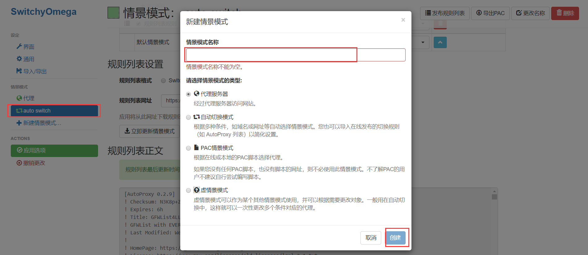
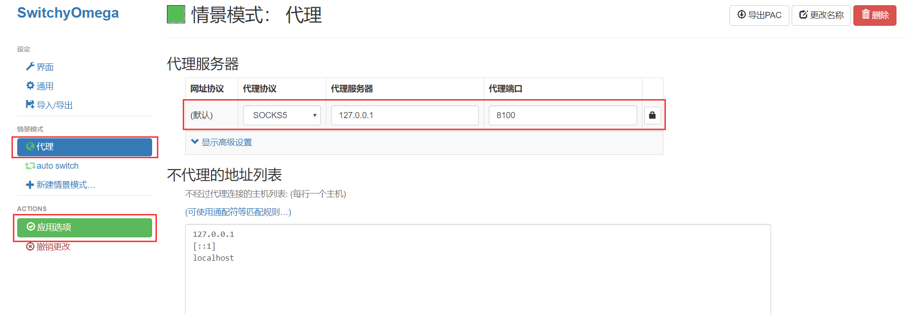
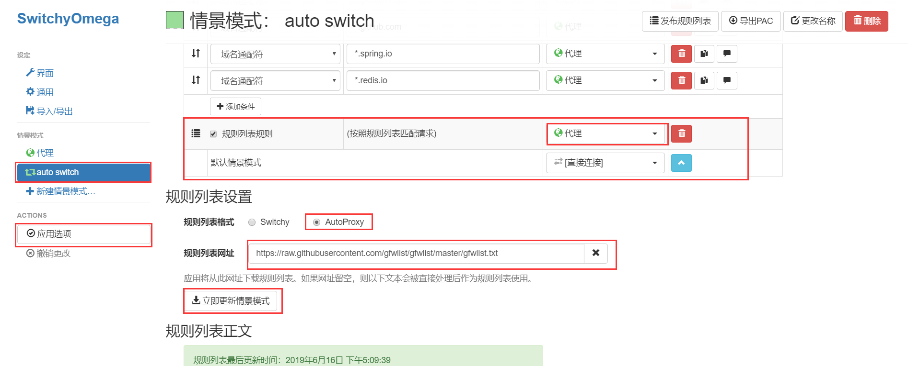

# SwitchyOmega

**SwitchyOmega**是一个代理设置工具，用于管理不同域名使用不同代理服务器

## 新增代理配置

点击左侧的**新建情景模式**，输入名称后点击**创建**按钮。

点击左侧刚刚创建的情景名称。配置如下信息，并点击**应用选项**：

## 配置GFW列表

在**SwitchyOmega**管理页面选择**auto switch**，下拉到**规则列表设置**，选择**AutoProxy**，并将`https://raw.githubusercontent.com/gfwlist/gfwlist/master/gfwlist.txt`填入**规则列表网址**，然后选择**立即更新情景场景**。

将上方匹配规则列表设置为刚刚新建的**情景模式**

点击左侧**应用选项**。

