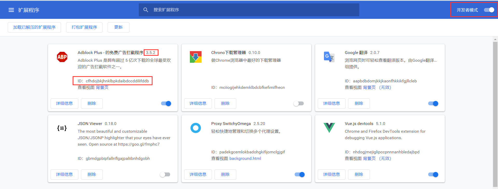
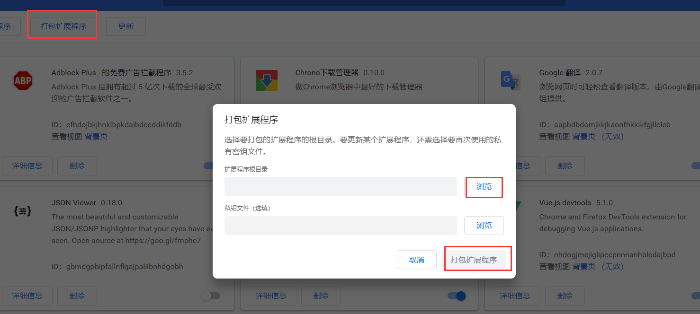

## 1. 打开扩展文件安装目录

资源管理器中打开下面的目录：

```
C:\Users\用户名\AppData\Local\Google\Chrome\User Data\Default\Extensions
```

该目录下存放着所有的插件，文件夹的名称就是插件的ID。

## 2. 打开chrome扩展程序管理页面

选择chrome工具栏最右侧的 三个点(.)，选择更多工具 > 扩展程序。

启用扩展程序左侧的 **开发者模式**



该页面中显示了扩展程序的ID以及版本号。

## 3.打包

点击扩展程序管理页面的 **打包扩展程序**



**扩展程序根目录**选择刚才资源管理器中打开路径的 + ID + 版本号，如：

```
C:\Users\用户\AppData\Local\Google\Chrome\User Data\Default\Extensions\cfhdojbkjhnklbpkdaibdccddilifddb\3.5.2_0
```

最后点击打包扩展程序，chrome会提示插件以及秘钥打包的位置。

