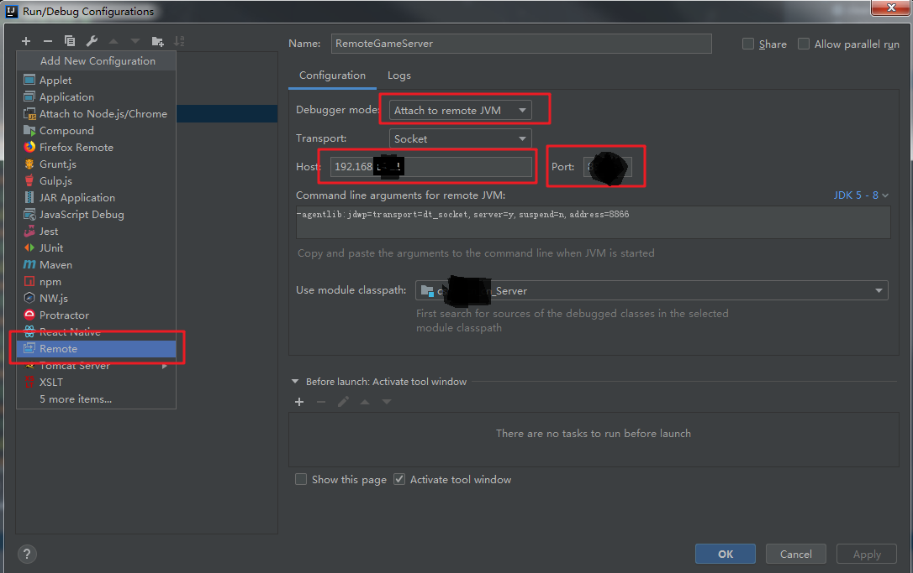

## 远程debug调试java代码

日常环境和预发环境遇到问题时，可以用远程调试的方法本地打断点，在本地调试。生产环境由于网络隔离和系统稳定性考虑，不能进行远程代码调试。

整体过程是通过修改远程服务JAVA_OPTS参数，然后本地通过Eclipse或IDEA等工具调试。

### 理论

JPDA（Java Platform Debugger Architecture）是Java平台调试体系结构的缩写。由3个规范组成，分别是JVMTI(JVM Tool Interface)，JDWP(Java Debug Wire Protocol)，JDI(Java Debug Interface) 。

* 1.JVMTI定义了虚拟机应该提供的调试服务，包括调试信息（Information譬如栈信息）、调试行为（Action譬如客户端设置一个断点）和通知（Notification譬如到达某个断点时通知客户端），该接口由虚拟机实现者提供实现，并结合在虚拟机中
* 2.JDWP定义调试服务和调试器之间的通信，包括定义调试信息格式和调试请求机制
* 3.JDI在语言的高层次上定义了调试者可以使用的调试接口以能方便地与远程的调试服务进行交互，Java语言实现，调试器实现者可直接使用该接口访问虚拟机调试服务。 java调试工具jdb，就是sun公司提供的JDI实现。eclipse IDE，它的两个插件org.eclipse.jdt.debug.ui和org.eclipse.jdt.debug与其强大的调试功能密切相关，其中前者是eclipse调试工具界面的实现，而后者则是JDI的一个完整实现。

### 远程调试

远程调试分为主动连接调试，和被动连接调试。

> 主动连接调试：服务端配置监控端口，本地IDE连接远程监听端口进行调试，一般调试问题用这种方式。
>
> 被动连接调试：本地IDE监听某端口，等待远程连接本地端口。一般用于远程服务启动不了，启动时连接到本地调试分析。

### 主动连接调试

首先需要远程服务配置启动脚本:

```shell
JAVA_OPTS="$JAVA_OPTS -Xdebug 
-Xrunjdwp:transport=dt_socket,server=y,suspend=n,address=8000"
```

如果是启动jar包，指令：

```shell
java -Xdebug -Xrunjdwp:transport=dt_socket,server=y,suspend=n,address=8000 -jar test.jar
```

| 命令      | 解释                                                         |
| --------- | ------------------------------------------------------------ |
| -Xdebug   | 通知JVM工作在DEBUG模式下                                     |
| -Xrunjdwp | 通知JVM使用(java debug wire protocol)来运行调试环境          |
| transport | 监听Socket端口连接方式                                       |
| server    | =y表示当前是调试服务端，=n表示当前是调试客户端               |
| suspend   | =n表示启动时不中断（如果启动时中断，一般用于调试启动不了的问题） |
| address   | =8000表示本地监听8000端口                                    |

### 被动连接

首先需要远程服务配置启动脚本:

```shell
JAVA_OPTS="$JAVA_OPTS -Xdebug 
-Xrunjdwp:transport=dt_socket,address=127.0.0.1:8000,suspend=y"
```

如果是启动jar包，指令：

```shell
java -Xdebug -Xrunjdwp:transport=dt_socket,server=y,suspend=n,address=8000 -jar test.jar
```

参数含义和主动连接调试一样，只是这里suspend=y表示启动时就中断，需要连接本地IDE调试启动。address=ip:port，ip需要修改为本地的对外IP。

这样远程项目启动时就连接到本地，方便调试项目启动不了的问题。

### IDEA远程debug



添加Remote配置，在右侧的`Configuration`窗口中配置具体内容。

如果是主动连接调试，`Debugger mode`选择`Attach to remote JVM`。

如果是被动连接调试，`Debugger mode`选择`Listen to remote JVM`。

