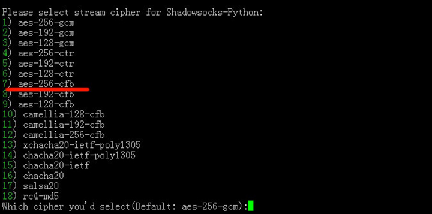
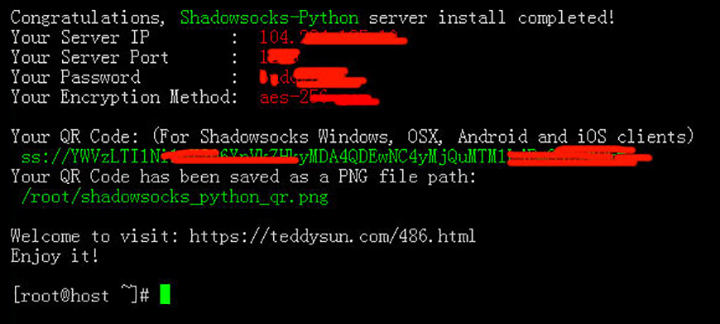

#### 安装shadowsocks

1、下载安装脚本

`wget --no-check-certificate -O shadowsocks-all.sh https://raw.githubusercontent.com/teddysun/shadowsocks_install/master/shadowsocks-all.sh`

下载按成后会在当前下载目录中出现`shadowsocks-all.sh`文件，如果下载不到可以使用`./software/shadowsocks-all.sh`


2、为脚本赋予执行权限

`chmod +x shadowsocks-all.sh`


3、执行脚本

`./shadowsocks-all.sh 2>&1 | tee shadowsocks-all.log`


4、出现以上画面后输入1，或者直接回车，下面会提示你输入你的SS SERVER的密码，和端口。不输入就是默认。跑完命令后会出来你的SS客户端的信息。


5、输入完成ss的密码和端口号之后，进行回车：


6、特别注意，由于iPhone端的的wingy目前只支持到**cfb**，所以我们选择**aes-256-cfb**，即**7** ，回车：



7、这一步按回车继续，然后需要几分钟的安装过程，请耐心等待出现下面的画面：



8、当我们看到*Congratulations, Shadowsocks-Python server install completed!*时，则证明我们已经成功安装了ss。请立即将这些信息复制下来加以保存，我们就会用到这几个比较重要的信息：主机服务器IP地址、端口号、密码和加密方式。上面的命令全部回车执行后，如果没有报错，即为执行成功，出现确认提示的时候，输入 y 后，回车即可。

#### Shadowsocks设备终端下载地址

[Windows版下载地址](https://github.com/shadowsocks/shadowsocks-windows/releases)

[Android版下载地址](<https://github.com/shadowsocks/shadowsocks-android/releases>)

[Mac版下载地址](<https://github.com/yangfeicheung/Shadowsocks-X/releases/>)

**iphone**因存在限制，国内用户无法在App Store搜到，可以使用如下代替

[Kite Ass Proxy](<https://itunes.apple.com/cn/app/kite-ss-proxy/id1346595633?mt=8>)

[FirstWingy](<https://itunes.apple.com/cn/app/firstwingy/id1316416848?mt=8>)

[SuperWingy](<https://itunes.apple.com/cn/app/superwingy/id1290093815?mt=8>)

#### 优化Shadowsocks性能

1、增加系统文件描述符，编辑`/etc/security/limits.conf`，新增如下两行，*不要忘记。

```
* soft nofile 51200
* hard nofile 51200
```

2、配置`/etc/sysctl.d/local.conf`

```properties
# max open files
fs.file-max = 1024000
# max read buffer
net.core.rmem_max = 67108864
# max write buffer
net.core.wmem_max = 67108864
# default read buffer
net.core.rmem_default = 65536
# default write buffer
net.core.wmem_default = 65536
# max processor input queue
net.core.netdev_max_backlog = 4096
# max backlog
net.core.somaxconn = 4096

# resist SYN flood attacks
net.ipv4.tcp_syncookies = 1
# reuse timewait sockets when safe
net.ipv4.tcp_tw_reuse = 1
# turn off fast timewait sockets recycling
net.ipv4.tcp_tw_recycle = 0
# short FIN timeout
net.ipv4.tcp_fin_timeout = 30
# short keepalive time
net.ipv4.tcp_keepalive_time = 1200
# outbound port range
net.ipv4.ip_local_port_range = 10000 65000
# max SYN backlog
net.ipv4.tcp_max_syn_backlog = 4096
# max timewait sockets held by system simultaneously
net.ipv4.tcp_max_tw_buckets = 5000
# TCP receive buffer
net.ipv4.tcp_rmem = 4096 87380 67108864
# TCP write buffer
net.ipv4.tcp_wmem = 4096 65536 67108864
# turn on path MTU discovery
net.ipv4.tcp_mtu_probing = 1

# for high-latency network
net.ipv4.tcp_congestion_control = hybla
# forward ivp4
net.ipv4.ip_forward = 1
```

2、使配置生效

```sh
sysctl --system
```

#### 配置多用户

修改`/etc/shadowsocks.json`

```json
{
 	"server":"本机外网IP",
	"local_address": "127.0.0.1",
	"local_port":1080,
	"port_password": {
  	    "端口1": "密码1",
        "端口2": "密码2"
	},
 	"timeout":300,
	"method":"aes-256-cfb",
 	"fast_open": false
}

```

#### 启动、停止

1. 建议使用后端启动
   - 前端启动：`ssserver -c /etc/shadowsocks.json`；
   - 后端启动：`ssserver -c /etc/shadowsocks.json -d start`；
   - 停止：`ssserver -c /etc/shadowsocks.json -d stop`；
   - 重启(修改配置要重启才生效)：`ssserver -c /etc/shadowsocks.json -d restart`
2. 设置开机启动
   1. 在终端输入`vi /etc/rc.local`，
   2. 把里面最后的带有ssserver的一大段默认的代码删除掉，
   3. 再把`ssserver -c /etc/shadowsocks.json -d start`加进去，
   4. 按`wq`保存退出。