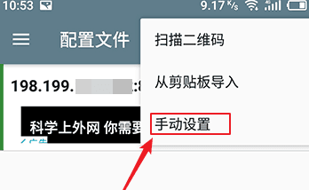
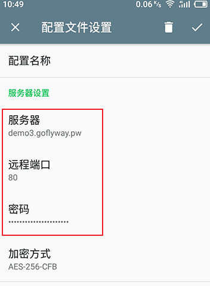

# GoFlyWay + CDN 

通过使用 GoFlyWay + CDN 的方式实现外网访问。

**优点**

* 隐藏个人VPN真实IP
* 被墙的IP也可以通过这种方式救活

## 前提准备

* VPS 一台
* centos7系统
* 个人域名一个

## namesilo

如果已有个人域名，可以跳过这一步。

### 注册账号

使用浏览器访问[namesilo官网](<https://www.namesilo.com/>)，点击**Create New Account**按钮。


完成**创建账户的上半部分**，部分英文解释如图：


完成**创建账户的下半部分**，部分英文解释如图：


页面拉倒最下方，输入验证码，同意协议后，点击**CREATE MY NEW ACCOUNT**进行注册。

### 购买域名

注册完成后通过首页第一步中**Create New Account**左边的**log in**登录。

登录成功后按下图的**顺序点击**


点击**register**【1】，在输入框中输入自己打算购买的域名【2】，点击**SEARCH**按钮【3】会弹出输入框下面的结果【4】，选择域名后缀【5】，点击**REGISTER CHECKED DOMAINS**。选择域名的过程完成。

弹出购物车页面，确认个人购买信息后点击**CONTINUE**按钮。


确认完成后会跳转付款页面，国内就选择支付宝，同时填写支付宝注册时的邮箱，如果没有，则填一个正在使用的邮箱，点击**GO**按钮后会进入支付宝的付款页面。扫码支付就可以了。


**支付成功后，等待完成可能需要几个小时的时间，如果超过两个小时未收到订单成功的邮件，请联系在线客服**


## cloudflare

### 注册账号

访问[cloudflare登录页面](https://dash.cloudflare.com/login)，点击**Sign up**按钮进行注册。根据网站流程进行注册账号。

注册成功后，cloudflare会要求输入网站地址，如下，输入刚才购买的域名。


输入完成后点击**add site**按钮，然后选择套餐，选择免费版就可以。确认方案后，Cloudflare会扫描该域名当前的DNS记录，你可以保留、添加或者删除：


我们在上图的红色框中输入name和ip地址，点击**Add Record**。之后点击**Continue**就是修改**NS**了。

### 配置NameServer

配置**NS**需要回到**namesilo**官网。选择**Manager My Domain**【1】，并在购买的域名前打勾【2】，点击**change name servers**【3】


namesilo会有三个默认的nameservers，将其删除，替换成cloudflare提供了地址，点击**COMMIT**按钮即可。首次解析域名可能需要一点时间，可以等待邮件通知。


## 安装GoFlyWay服务端

通过命令行工具连接主机后，执行如下命令，或者使用[离线脚本](./software/goflyway.sh)

```shell
wget -N --no-check-certificate https://raw.githubusercontent.com/ToyoDAdoubi/doubi/master/goflyway.sh && chmod +x goflyway.sh && bash goflyway.sh
```

之后输入1即可进行安装，其中**端口选择80**，HTTP伪装填写

http://kernel.ubuntu.com/~kernel-ppa/mainline/

**密码必须设置为：   ?c域名:端口号**

例如：购买的域名为 testd.top，在cloudflare中解析的名字为 fly， 那么我们的密码应该为 :`?cfly.testd.top:80`。这样设置密码是为了安卓客户端使用。


## 安装客户端

### windows

访问[下载GoFlyWay Tools](http://yun.iiwl.cc/s/ivmmqekw)

**功能简介**：
支持 多服务器管理
支持 直连模式、PAC模式、全局模式
支持 生成/导入 分享链接功能（分享链接格式）
支持 HTTP、KCP、CDN、WebSocket 传输协议
支持 账号自检
支持 开机启动
等等
和酸酸乳shadowsocks差不多一样的。
其他不介绍，放图和教程就行。


打开之后就差不多是这样，我这个是导入了配置界面。
其中协议一般是http，因为此节点被墙，使用了伪装，所以选择cdn。

**配置**

1.最简单的方法就是导入分享链接，上面仔细看就行
2.点击浏览，选择相应位数的文件


### android

访问[GoFlyWay release下载apk](https://github.com/coyove/goflyway/releases)

由于该apk是使用shadowsocks进行修改的，所以手机上如果安装可shadowsocks，需要先将其卸载后再安装。

打开 Goflyway 安卓客户端后，可以看到一个默认的账号，因为 Goflyway 安卓客户端是基于 Shadowsocks 安卓客户端修改而来的，所以此处的默认账户实际上是 Shadowsocks 安卓客户端自带的 SS 账号，删除该账号。

点击右上角的+号，选择手动配置



然后依次填写 服务器、远程端口、密码 这三项即可。



在该页的配置中，可以启用**分应用VPN**指定使用VPN的应用程序。


## 参考

[域名解析教程：Cloudflare解析与DNSPod解析](https://blog.csdn.net/wf632856695/article/details/86689607)

[IP被墙怎么办？利用Goflyway+CDN救活你的被墙IP！](https://www.xiaobaidaxue.com/operation/288.html)

[GoFlyway全解+让被墙IP继续“上班”](https://www.lsland.cn/Technical/453.html)

[GoFlyway 基础教程Android 客户端使用方法](https://doubibackup.com/wlqx27bd.html)

[GoFlyWay github 托管地址](https://github.com/coyove/goflyway)

