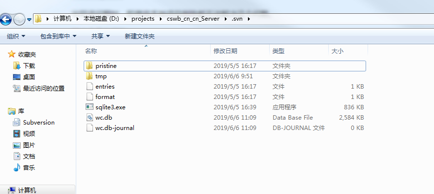

## 问题

svn执行`clean up`命令时报错:`Previous operation has not finished; run 'cleanup' if it was interrupted`。

出现该问题时，即使将本地项目删除都无法解决这个问题。

解决方案有两种:

* 卸载SVN重新安装
* 修改SVN数据库

## 修改SVN数据库

每个项目的根目录都存在一个`.svn`的隐藏文件夹，该文件夹下保存了SVN对于该项目的基础配置。

解决上述问题的关键在于修改`.svn/wc.db`数据库，清空内部的`WORK_QUEUE`表。

### 1、下载sqlite3客户端

由于SVN使用的是`sqlite`数据库，所以我们需要使用`sqlite3.exe`这个客户端文件。该可执行文件可以直接百度下载。

### 2、启动sqlite3客户端

1、将下载好的`sqlite3.exe`复制到需要操作的项目的`.svn`目录下：

2、在当前目录下使用`SHIFT + 鼠标右键`进入命令行。执行`sqlite3 wc.db`打开数据库

### 操作sqlite3数据库

`.table`用于查看数据库内部的表

上图我们可以看到`WORK_QUEUE`表。

执行`delete from work_queue;`命令清空所有任务

重新`clean up`，问题解决。